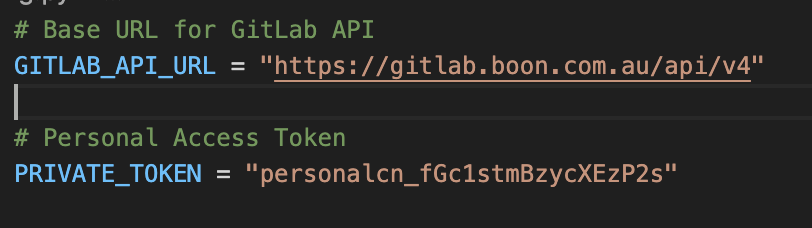

## Overview
This is a simple command-line tool to interact with the GitLab API.  
It allows you to perform CRUD operations on GitLab projects using a local database.

## Project Structure
gitlab_cli/
├── README.md                # Documentation on usage, setup, demo
├── requirements.txt         # Dependencies (requests, SQLAlchemy, etc.)
├── .gitignore               # Ignore venv, db, pycache
├── gitlab.db                # SQLite database (auto-created, should be .gitignored)
├── main.py                  # CLI entry point (argparse + commands)
├── services.py              # Business logic: fetch, add, update, delete, list
├── db.py                    # Database models & session management
├── config.py                # Config (API URL, Private token, DB URL)
├── openapi_test.py          # (optional) playground for OpenAPI client testing
├── gitlab_openapi_client/   # (optional) generated client package, if used

## Requirements
- Python 3.9+  
- Virtual environment

Install dependencies:
```bash
pip install -r requirements.txt

## Configuration
Set your GitLab API details in config.py:


## Usage
Activate virtual environment:
```bash
source .venv/bin/activate

1. Fetch projects from GitLab API (Create)
```bash
python main.py fetch --per-page 5 --page 1

2. List projects (Read)
```bash
python main.py list

3. Add a project manually (Create)
```bash
python main.py add 999 "demo-project" --description "Demo project"

4. Update a project description (Update)
```bash
python main.py update 999 "Updated description"

5. Delete a project (Delete)
```bash
python main.py delete 999

